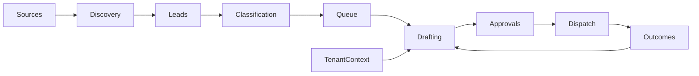

# Architecture

A map of current code ownership and data flow. Read the linked guides for configuration and operation.

## Product

Noelle coordinates social content, conversations, outreach and measured results within an organization. The public registry contains X, LinkedIn, Reddit and video profiles. Availability and execution depend on configured instances, workers and platform capabilities.

The dashboard centers on Overview, Engage, Content, People and Settings. Settings contains channel, voice and workspace configuration, with connected services and usage alongside them. People and saved context are organization-scoped.

## Runtime and entrypoints

Native installations run the API, dashboard and workers through the CLI's managed process lifecycle with configured Postgres. `noelle sync` builds the dependency graph, applies migrations and synchronizes the managed runtime. The dashboard can also use a hosted deployment and Supabase session authentication. Legacy infrastructure remains separate from the local installation.

Use [the runbook](runbook.md) for operation and [the workflow guide](../.github/workflows/README.md) for validation. Hosts, credentials and enabled workers belong to each installation.

## Ownership

| Owner | Responsibility |
|---|---|
| `apps/app` | Next.js 16 dashboard; pages compose shared controls and org-scoped server actions. |
| `apps/api-vm` | Hono routes, authentication, scheduler and API-local storage policies. The name also covers native operation. |
| `apps/cli` | Installation, process management, migrations and synchronization. |
| `apps/noelle-mcp` | Tool contracts and handlers; uses shared approval mutations. |
| `apps/x-intern`, `apps/linkedin-intern`, `apps/reddit-intern`, `apps/video-intern` | Platform workers and feature-specific source, queue and content policies. |
| `apps/x-actuator`, `apps/linkedin-actuator`, `apps/reddit-actuator` | Platform browser commands, DOM evidence and dispatch orchestration. |
| `packages/contracts` | Shared validated wire shapes and target identity. |
| `packages/agents` | Agent definitions, registry manifests and capability routing. |
| `packages/runtime` | Tenant predicates, model routing, budgets, approval transitions, retrieval and bounded HTTP/Postgres operations. |
| `packages/worker-runtime` | Worker loop, boot checks, signals and logging; intern apps keep compatibility shims. |
| `packages/process` | Child-process admission, output limits, deadlines and process-group cleanup. |
| `packages/secrets` | Secret names, environment mapping, coalesced retrieval and bounded caching; SDK operations delegate to the process owner. |
| `packages/actuator-cdp` | Shared CDP effects, browser scheduling and serialized run-state storage. |
| `packages/x-client` | Shared X reads, official API writes, source values, refresh coordination and write-error taxonomy. |
| `packages/runtime/src/vaultStorage.ts`, `apps/vault-daemon` | Tenant file storage and ordered local mirror/watch lifecycle. |

Keep a feature's rules beside that feature. Move code used across apps into a public shared package; shared packages must not depend on app internals. Migrate callers when moving an owner. Platform policies remain explicit where their targets or confirmation evidence differ.

### Dashboard presentation

`apps/app/src/app/globals.css` owns the dashboard palette, typography and shell. `components/theme/theme-preferences.ts` resolves persisted preferences for both the initial paint and the client provider. Pages compose reusable owners and retain organization-scoped data and action contracts.

| Dashboard owner | Responsibility |
| --- | --- |
| `src/components/nav` | Workspace navigation, links and page headers |
| `src/components/ui` | Shared controls, avatars and interaction states |
| `src/components/growth` | Overview panels, channel settings and workspace presentation |
| `src/components/approvals` | Engage review streams, filters and selection controls |
| `src/components/posts` | Content ideas, drafts, media and planning views |
| `src/components/contacts` | People rows and contact presentation |
| `src/lib/queries.ts`, `src/lib/growth-overview.ts`, `src/lib/social-channels.ts` | Scoped reads, observed overview data and supported channel configuration |

## X data flow

1. Discovery saves source identities and measurements; unknown values remain unknown. Instance status and each worker's enable flags govern admission. Paused instances can still admit explicitly enabled watchlist, profiler or scheduled-send work; `apps/x-intern/src/lib/activation.ts` owns that distinction.
2. Classification supplies relevance evidence. `apps/x-intern/src/lib/reply-opportunity.ts` owns the separate queue heuristic for quality, freshness, engagement snapshots, author pressure and conversation diversity. These values are inspectable proxies, not predictions from X's feed model.
3. Drafting assembles the objective, standing rules, current source and tenant context. Shared retrieval and factual-context contracts keep untrusted source content distinct from supported account facts. Optional reply-diversity checks reuse the existing outgoing-text policy.
4. Review and dispatch retain current approval/source bindings. `packages/runtime/src/approvalMutationDb.ts` owns edit/skip/restore/park transitions; `apps/api-vm/src/lib/manual-sent-db.ts` owns sent/undo receipts. Platform send protocols own reservations and confirmation evidence.
5. Metrics workers save measured outcomes and capture times. `apps/x-intern/src/lib/own-performance.ts` and its data modules turn comparable account observations into bounded drafting context. Missing counts, unequal observation windows and unknown submission outcomes must not become invented success.

Model choice resolves through `packages/runtime/src/workerRouting.ts` and the platform routing adapter. Per-worker and per-instance overrides select the effective engine. `callAgentModel` owns call accounting and budget admission.

## Trust and resource boundaries

The dashboard supports Supabase sessions and the CLI's local operator-auth mode. Hono user routes verify JWTs; worker write routes use HMAC; actuator routes use their own scoped token middleware. Organization membership and current instance/lead/draft/approval ownership remain required after authentication. `packages/runtime/src/tenancy.ts` and shared context predicates own those checks.

Product data uses the configured Postgres connection. Migrations under `infra/cloudsql/schema` define the current relational contract even for native installations. Data access uses the configured role; privileged schema changes belong to the migration lifecycle. Secrets go through the shared secret owner.

External work must have finite admission, deadlines, byte limits and retries where replay is safe. Use the existing bounded HTTP, Postgres and process owners. Keep provider/browser work outside database leases. Preserve unknown results when a side effect may already have happened; a timeout is not permission to repeat a write.

A worker records its completion or failure through its current run owner. Video batches stop admission on canonical budget/resource failures, and owned cleanup is awaited. Vault watcher shutdown drains accepted writes and evaluates deletions through the current mirror policy. See [testing](testing.md) for source, compiled-consumer and native database validation.

## Related docs

- [Agent model](agent-model.md): definitions, manifests and instance rows.
- [Database contract](database-contract.md): tenant data and relationships.
- [Grounded drafting](grounded-drafting.md): context and review policy.
- [Reply actuation](reply-actuation-strategy.md): platform dispatch boundaries.
- [Vault](vault.md): tenant storage, indexing and retrieval.
- [Secrets](secrets.md): credential ownership.
- [Testing](testing.md): validation layers and CI.
- [Runbook](runbook.md): runtime operations.
